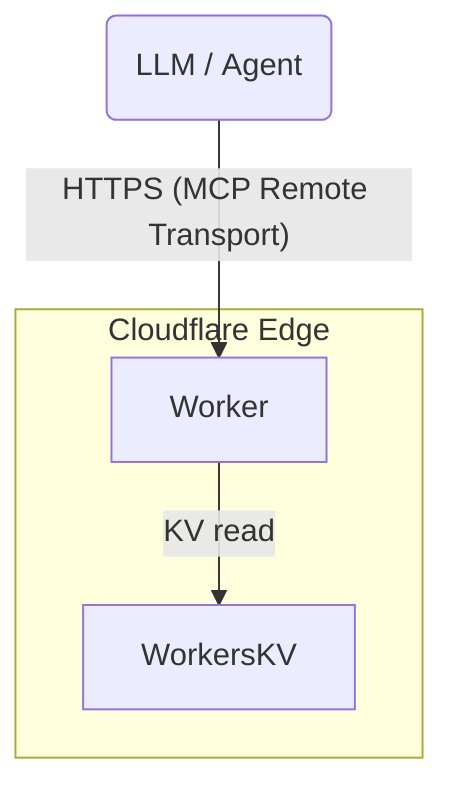

# MCP "About‑Me" Server – Product Requirements Document

## Executive Summary
We will launch an auth‑less Model Context Protocol (MCP) server at `https://ai.<your‑domain>.com/mcp`, running on Cloudflare Workers. The server exposes read‑only endpoints that return either a PDF blob or structured JSON describing your résumé, GitHub projects, and LinkedIn summary. It demonstrates hands‑on skill with Workers, KV storage, Wrangler, and the MCP spec while giving AI agents a friction‑free way to consume your public profile.

## Objectives & KPIs
| # | Objective | KPI |
|---|-----------|-----|
| 1 | Machine‑readable public profile via MCP | ≥ 95 % of remote MCP client test‑suite passes |
| 2 | Showcase Cloudflare Workers & MCP expertise | One‑click `wrangler deploy` documented in README |
| 3 | Privacy preservation | No phone number, personal email, or street address present in any response |

## Target Users & Key Use‑Cases
1. **LLM / AI agents** fetching canonical facts about you for job‑matching or Q&A.  
2. **Recruiters & hiring tools** that rely on agents to pre‑screen candidates.  
3. **You**, as a portfolio artifact you can link in cover letters or social posts.

## Scope

### In‑Scope
* **Auth‑less MCP server** (spec v0.2) deployed on Cloudflare Workers.
* **Public tools**
  * `get_resume_pdf` – returns résumé PDF (stored in KV).
  * `get_resume_json` – returns résumé metadata as JSON.
  * `list_projects` – concise index of GitHub repos.
  * `get_project_by_slug` – full project details.
  * `get_linkedin_summary` – high‑level career narrative.
* **Data layer** – static objects in Workers KV.
* **Edge path** – everything mounted under `/mcp/*` on sub‑domain.
* **Manual updates** – résumé or project data changed by committing files to repo (no auto‑sync).

### Out‑of‑Scope
* Authentication / OAuth (kept simple for MVP).
* Write or mutation endpoints.
* Full‑text search or vector search.

## Functional Requirements
| ID | Requirement |
|----|-------------|
| FR‑1 | Server MUST implement MCP Remote Transport handshake per spec §4.2. |
| FR‑2 | `GET /mcp/manifest` MUST list all tools with JSON schemas. |
| FR‑3 | Each tool MUST complete < 500 ms at p95 globally (edge‑cached KV lookup). |
| FR‑4 | Responses MUST strip PII (phone, personal email, street address). |
| FR‑5 | Server SHOULD expose `GET /health` returning HTTP 200 for monitoring. |
| FR‑6 | Basic abuse protection: 1 000 requests / IP / day using Durable‑Object rate limiter. |
| FR‑7 | Repository MUST contain a one‑command deploy script via `wrangler deploy --minify`. |

## Data Model

| KV Key | Value (JSON unless noted) |
|--------|---------------------------|
| `resume/pdf` | **Binary** PDF résumé |
| `resume/json` | `{ name, title, location, skills[], experience[] }` |
| `projects/index` | `[ { slug, name, brief } ]` |
| `projects/<slug>` | Full project details (repo URL, tech stack, highlights) |
| `linkedin_summary` | Markdown string (≤ 3 paragraphs) |

All keys are immutable until you overwrite via manual commit and redeploy.

## Technical Architecture & Endpoints

| Route | Method | Purpose |
|-------|--------|---------|
| `/mcp/manifest` | `GET` | Static MCP tool list |
| `/mcp/tool/<name>` | `POST` | Invoke tool with JSON args |
| `/health` | `GET` | Uptime probe |

## Open Questions (Resolved)
| # | Resolution |
|---|------------|
| 1 | **Résumé storage:** keep both PDF and structured JSON; separate tools fetch each. |
| 2 | **Data freshness:** manual commits only; no auto‑sync. |
| 3 | **Routing:** server lives at `/mcp`; root path hosts a simple landing page. |
| 4 | **Legal:** no special license text required. |

## References
* Cloudflare Workers documentation
* Model Context Protocol specification
* Worker KV storage guide
